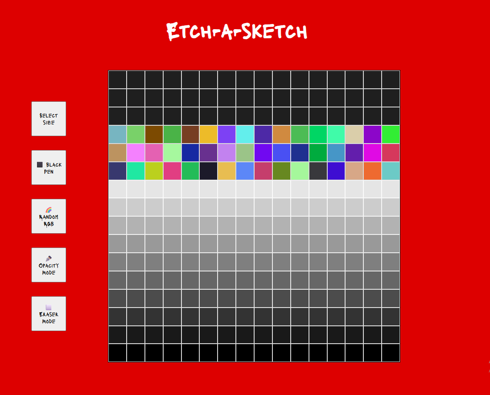

# Etch-a-Sketch

> Um projeto de desenho digital similar ao brinquedo "Etch A Sketch", desenvolvido com HTML, CSS e JavaScript.

## 🚀 Live Preview

**[Clique aqui para testar o projeto](https://elvismourab.github.io/etch-a-sketch/)**

## 📖 Descrição

Este projeto faz parte do currículo do [The Odin Project](https://www.theodinproject.com). 
O objetivo é aplicar os aprendizados sobre manipulação do DOM e flexbox.

-> [Project: Etch-a-sketch](https://www.theodinproject.com/lessons/foundations-etch-a-sketch)

## ✨ Funcionalidades

- **Select size:** Comece com um grid padrão de 16x16 e ajuste o tamanho de 1x1 até 100x100.
- **⬛ Black pen:** O modo clássico para desenhar com a cor preta.
- **🌈 Random RGB:** Pinta cada quadrado com uma cor RGB diferente.
- **✒️ Opacity mode:** A cada passada, a caneta cria um efeito de sombra.
- **⬜ Eraser mode:** Apaga a cor dos quadrados.

## 🛠️ Tech Stack

- HTML
- CSS
- JavaScript

## 🧠 O que aprendi

- Manipulação do DOM com document. `getElementById`, `createElement`, `appendChild`, etc.
- Utilização de handler compartilhado que lê flags globais (blackPenMode, randomMode, opacityMode, eraserMode).
- método setProperty para atribuir width e height dinamicamente no css.

## 💻 Como Executar Localmente

1. Clone o repositório.
2. Entre no diretório.
3. Abra o `index.html` no navegador.
